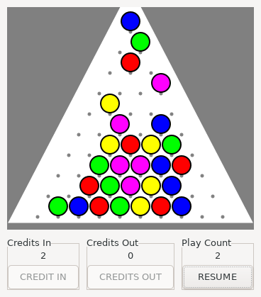
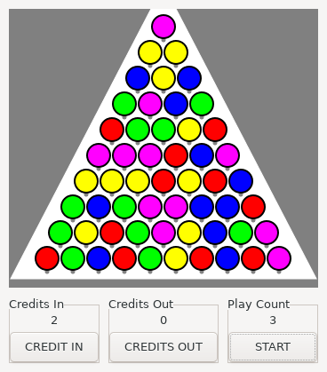

# galton-board
Simple simulation of balls falling in a Galton board

# Build & Run

    $ ./autosetup.sh
    $ ./configure
    $ make
    $ ./galton_board

## Containerized

    $ docker build -t galton_board .
    $ setfacl -m user:1000:r ${HOME}/.Xauthority
    $ docker run --rm -it -v ${HOME}/.Xauthority:/home/user/.Xauthority --net=host -e DISPLAY galton_board

# Screenshots

